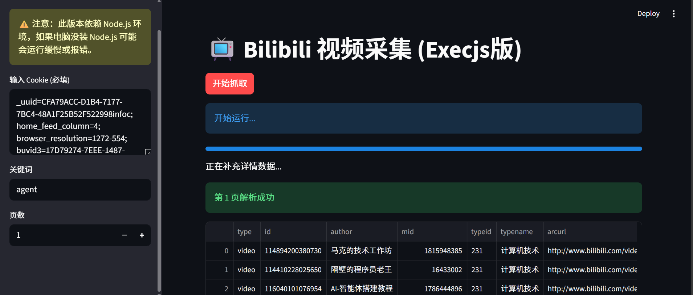

<div align="center">

# 📺 Bili-search

[](https://www.python.org/)
[](https://streamlit.io/)
[](https://nodejs.org/)
[](LICENSE)

**一个基于 Streamlit 的 Bilibili 视频数据可视化采集工具**
<br>
无需繁琐配置，支持关键词搜索、数据预览与 CSV 一键导出。

[📥 下载 Windows 绿色懒人包](#-下载免安装绿色版) • [🚀 开发者运行指南](#-开发者运行指南) • [⚠️ 免责声明](#-免责声明)

</div>

---

## ✨ 功能特性 (Features)

- 🕷️ **精准采集**：支持通过关键词搜索 B 站视频，自动翻页抓取。
- 🛡️ **逆向参数**：内置 `ExecJS` 引擎，自动处理 `b_lsid` 和 `__pinia` 等反爬参数。
- 📊 **可视化界面**：基于 Streamlit 构建的 Web UI，操作简单直观。
- 💾 **数据导出**：支持一键导出采集结果为 `CSV` 表格文件，自动处理中文乱码。
- ⚡ **绿色便携**：提供 Windows 免安装版本，内置 Python + Node.js 环境，解压即用。

## 📸 运行截图 (Screenshots)

<!-- 建议你在仓库里新建一个 images 文件夹，放入截图，然后替换下面的链接 -->


> *界面简洁，无需编写任何代码即可完成数据采集。*

---

## 📥 下载免安装绿色版

如果你不想配置 Python 环境，请直接下载打包好的 **Windows 懒人包**（内置 Python 和 Node.js）：

| 版本 | 说明 | 下载地址 |
| :--- | :--- | :--- |
| **v1.0 Portable** | **推荐**：解压后双击 `启动.bat` 即可使用 | [点击前往百度网盘](你的网盘链接) <br> (提取码: `你的提取码`) |

---

## 👨‍💻 开发者运行指南

如果你是开发者，想修改源码或在本地运行，请按以下步骤操作。

### 1. 环境要求
- **Python**: 3.8 或更高版本
- **Node.js**: **必须安装** (用于 ExecJS 执行 JS 逻辑) [下载地址](https://nodejs.org/)

### 2. 安装依赖
```bash
# 1. 克隆仓库
git clone https://github.com/你的用户名/bili-search.git

# 2. 进入目录
cd bili-search

# 3. 安装 Python 依赖
pip install streamlit requests loguru pandas bibtexparser PyExecJS
```

### 3. 启动应用
```bash
streamlit run bili_search.py
```
启动后，浏览器会自动打开 `http://localhost:8501`。
如果没有打开，可自行复制网址于浏览器打开
---

## 📂 项目结构

```text
bili-search/
├── bili_search.py      # 主程序入口 (Streamlit 界面)
├── LICENSE             # 开源协议
└── README.md           # 项目说明文档
└── bili-search.png     # 运行截图
```

---

## ⚠️ 免责声明 (Disclaimer)

> **请务必仔细阅读！**

1. **仅供学习**：本项目仅用于 **Python 爬虫技术交流与 Streamlit 框架学习**，代码仅供参考。
2. **严禁商用**：严禁将本工具用于商业用途、大规模批量抓取或任何侵犯 Bilibili 平台利益的行为。
3. **后果自负**：使用者在使用本工具时，应遵守 Bilibili 网站的 `User Agreement` 和 `Robots` 协议。因使用本工具导致的任何后果（包括但不限于账号被封禁、IP 被限制、法律纠纷等），**作者不承担任何责任**。
4. **版权声明**：本项目遵循 MIT 开源协议。如果您下载并使用了本工具，即代表您同意上述所有条款。

---

## 🤝 贡献 (Contribution)

欢迎提交 Issue 或 Pull Request！如果你觉得这个项目对你有帮助，请给一个 ⭐️ **Star**！
